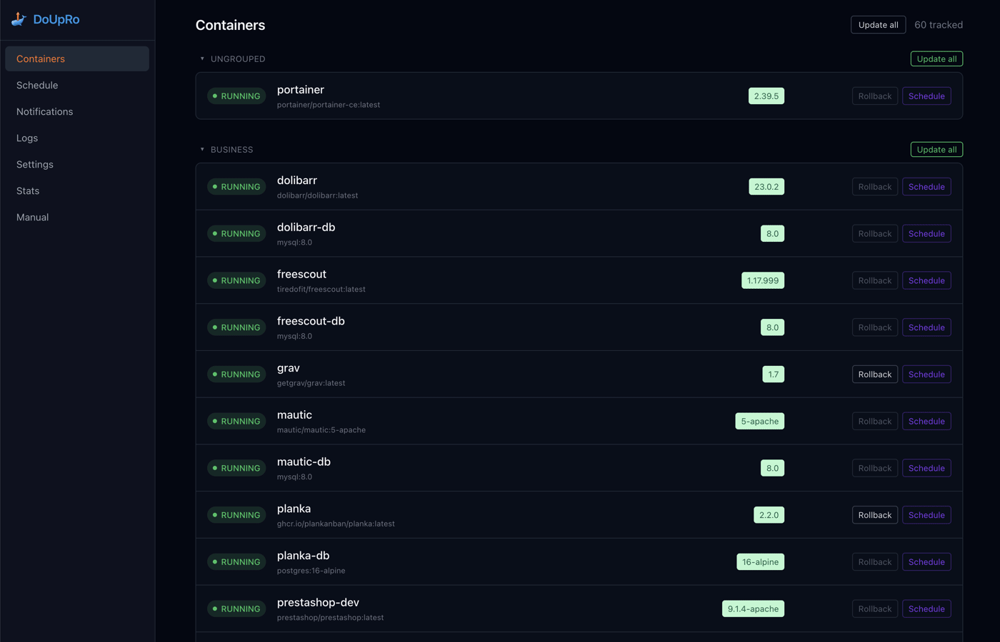

<div align="center">

# DoUpRo
*Pronouced 'do pro'*


<p>
  <strong>Do</strong>cker <strong>Up</strong>date <strong>Ro</strong>llback
</p>

<p>
  A self-hosted watcher for your Docker host — see what's outdated,
  update it now or on a schedule, and roll back with one click if
  something breaks.
</p>

<p>
  
  
  
</p>

Multi-arch image (`linux/amd64`, `linux/arm64`)

</div>

---

## 👀 What it looks like

<p align="center">
  
</p>

<p align="center">
  <sub>Containers · Schedule · Notifications · Logs · Stats</sub>
</p>

Every container's status is a real Docker state.
guess — shown consistently across Containers, Schedule, and Stats:

<p align="center">
  
</p>

## ✨ Why DoUpRo exists

Watchtower-style tools update your containers silently, and you find out
after the fact — or not at all. On the other end, doing it all by hand
(`docker compose pull && up -d`, one stack at a time, hoping nothing
breaks) doesn't scale past a handful of containers.

DoUpRo sits in between: it watches every container on the host — running
or stopped — resolves the actual version behind a floating tag when the
registry lets it, and gives you the choice every time: update now,
schedule it, or let a stack auto-update on its own recurring policy. If
an update makes a container crash-loop, DoUpRo reverts it automatically.
Nothing happens without being logged, and nothing is ever a one-way door.

## 🚀 Key features

- **See what's outdated, precisely.** Real Docker state (not just
  "running"), current vs. available version resolved from the registry's
  actual metadata — not just a floating tag guess.
- **Update now, later, or automatically.** One-off schedules, recurring
  per-stack policies (cron or relative delay), and a global
  detect-only-by-default posture — auto-apply is an explicit opt-in.
- **Rollback that's always there.** Every update keeps the previous
  image and full container config on record. Manual rollback any time;
  automatic rollback if a container crash-loops after an update.
- **Notifications where you already are.** Telegram, Discord, Slack,
  ntfy, Gotify, or any generic webhook via a single URL scheme, with
  per-channel event/stack/container filters and a durable delivery queue.
- **One API, three doors in.** Web UI, CLI, and REST API are all thin
  clients of the exact same backend — none of them can ever behave
  differently from the others.
- **Built for a real homelab.** RBAC (users + scoped API keys), OIDC/SSO,
  encrypted secrets at rest, structured JSON logs (Loki/ELK-ready),
  Prometheus metrics, and a Content-Security-Policy-hardened web UI.

## 📦 Installation

### `docker run`

```bash
docker run -d \
  --name doupro \
  --restart unless-stopped \
  -p 8080:8080 \
  -v /var/run/docker.sock:/var/run/docker.sock \
  -v doupro_data:/data \
  --group-add "$(getent group docker | cut -d: -f3)" \
  sharlihe/doupro:latest
```

No admin credentials needed to get started: DoUpRo bootstraps an
`admin` / `admin` account and forces a password change on first login.
Set `DOUPRO_ADMIN_USER`/`DOUPRO_ADMIN_PASSWORD` (both, not just one) to
skip that and start with a real password from the very first boot.

### Docker Compose

```bash
cp .env.example .env   # optionally set DOUPRO_ADMIN_USER/PASSWORD and DOCKER_GID
docker compose up -d
```

See [`docker-compose.yml`](docker-compose.yml) and
[`.env.example`](.env.example) for the full, annotated example. Then open
`http://<host>:8080`, log in with `admin` / `admin`, and set a real
password when prompted.

### CLI

The same binary is also a CLI client — from any machine that can reach
the API, or with zero flags at all from inside the container itself:

```bash
# Remote, with an API key created from Settings → Security
export DOUPRO_HOST=https://doupro.home.arpa
export DOUPRO_API_KEY=...
doupro containers list

# From docker exec — no --host/--api-key needed
docker exec -it doupro doupro containers list
```

Full command reference: [`manuals/cli.md`](manuals/cli.md).

## 🛠️ How it works

1. DoUpRo discovers every container on the Docker socket, running or
   stopped, and checks its registry for a newer image on a configurable
   interval.
2. When an update is available, the container's row shows it — with the
   resolved version when the registry provides one, not just a floating
   tag.
3. Update it right away, schedule it for a specific time, or opt the
   whole stack into a recurring policy (cron or relative delay).
4. DoUpRo pulls, recreates the container with its exact existing config,
   and waits for it to come up healthy — reverting automatically if it
   doesn't.
5. Roll back manually any time a previous version is on record, or let
   DoUpRo do it for you if the container crash-loops after an update.

## 📚 Documentation

- **[`manuals/`](manuals/)** — the end-user guide (also rendered in-app
  under **Manual**): [Getting started](manuals/getting-started.md),
  [Containers](manuals/containers.md), [Schedule](manuals/schedule.md),
  [Notifications](manuals/notifications.md), [Logs](manuals/logs.md),
  [Settings](manuals/settings.md), [Stats](manuals/stats.md),
  [CLI](manuals/cli.md), [FAQ](manuals/faq.md).
- **REST API** — interactive Swagger UI at `/swagger` on your own
  instance.
- **[`SECURITY.md`](SECURITY.md)** — threat model, hardening posture, and
  how to report a vulnerability.

## 🏗️ How it's built

Single Go binary, single container, one HTTP port serving both the REST
API and a server-rendered web UI (htmx + Alpine.js + Tailwind — no
separate frontend build, no Node process at runtime). SQLite for storage
(no CGO — `modernc.org/sqlite`), `containrrr/shoutrrr` for multi-channel
notifications, Prometheus metrics, structured JSON logging. API-first by
design: the web UI and CLI are both thin clients of the same REST API,
so a feature that isn't in the API doesn't exist yet anywhere else
either — see `/swagger` on your own running instance for the full
surface.

## 🔒 Security note

DoUpRo needs read/write access to the Docker socket to inspect and
recreate containers — this is **equivalent to root access on the host**.
Mount it deliberately, run DoUpRo behind your own network boundary or
reverse-proxy auth, and consider a
[docker-socket-proxy](https://github.com/Tecnativa/docker-socket-proxy)
for a more restricted setup. Full details in [`SECURITY.md`](SECURITY.md)
— found a vulnerability? Please report it privately, as described there.

## 🤝 Contributing

Bug reports, feature requests, docs fixes, and code are all welcome — see
[`CONTRIBUTING.md`](CONTRIBUTING.md) to get set up, and
[`CODE_OF_CONDUCT.md`](CODE_OF_CONDUCT.md) for how we treat each other
here.

## 📄 License

[MIT](LICENSE) © Arnaud Charles
